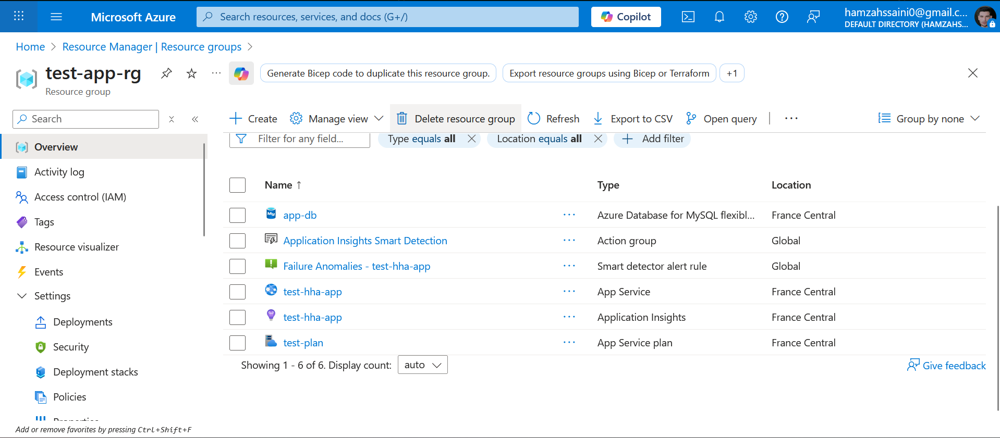
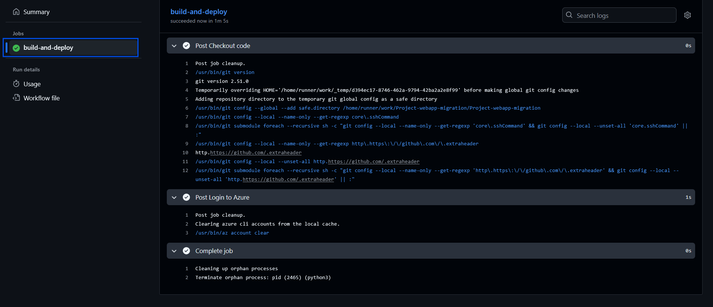
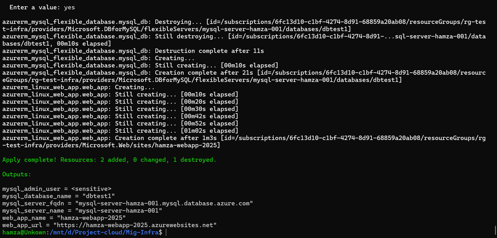
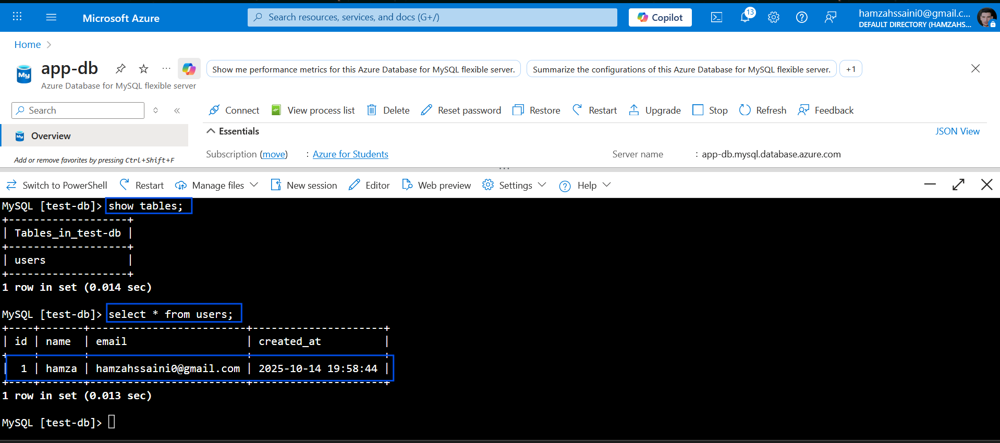
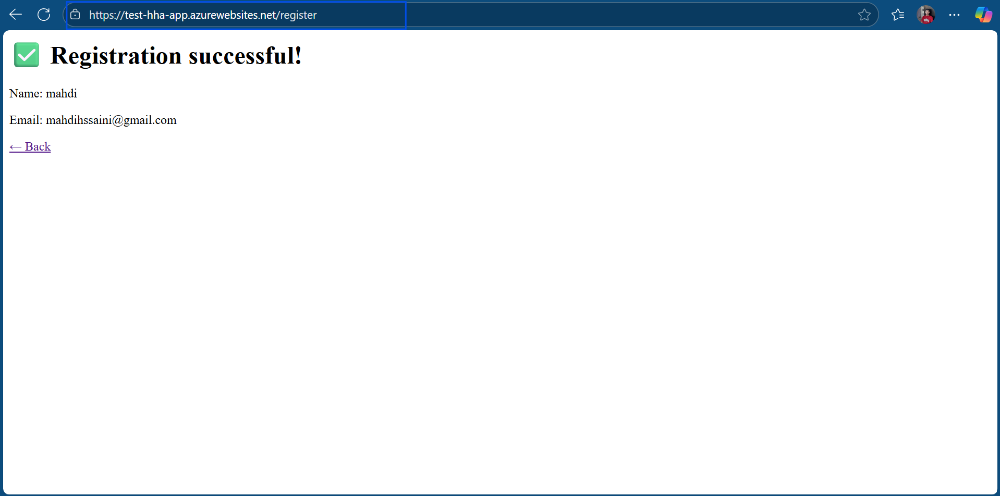
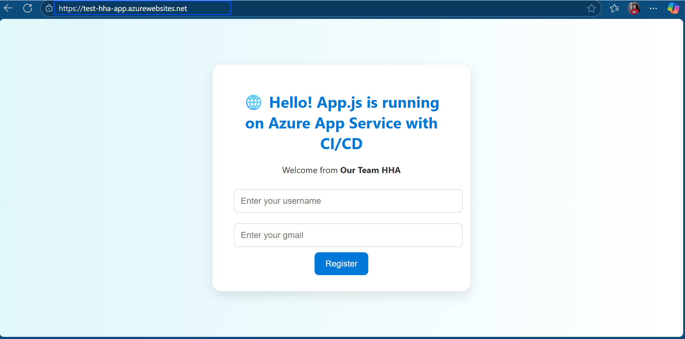

# mig-to-azure-via-Terraform

Professional, clean, and opinionated Terraform configurations and guidance to help migrate infrastructure and workloads to Microsoft Azure.

---

## Overview

This repository provides reusable Terraform modules, environment overlays, and examples to plan, provision, and manage Azure resources required during a migration. It is intended as a starting point you can adapt to your organization's standards and governance.

Goals:
- Provide repeatable, modular Terraform code for common Azure services.
- Demonstrate secure state management and environment separation.
- Include a minimal quickstart to deploy and validate a test environment.

---

## Prerequisites

- Terraform 1.4+ (or a compatible version)
- Azure CLI (`az`) v2.30+ (or equivalent)
- An Azure subscription with permissions to create resource groups, storage accounts, and service principals
- Recommended: CI/CD system (GitHub Actions, Azure DevOps, etc.) for automation

---

## Repository structure

- modules/                - Reusable Terraform modules (network, compute, storage, etc.)
- envs/                   - Environment-specific overlays (dev, stage, prod)
- examples/               - Example usage and quickstart configurations
- scripts/                - Helper scripts (bootstrap, state setup, helpers)
- images/                 - Project screenshots used in this README
- README.md               - This file

Treat `modules/` as the unit of reuse and `envs/`/`examples/` as wiring for environments and demos.

---

## Quickstart (local)

1. Clone the repo:
```bash
git clone https://github.com/hamzahssaini/mig-to-azure-via-Terraform.git
cd mig-to-azure-via-Terraform
```

2. Authenticate to Azure:
```bash
az login
# Optionally set subscription
az account set --subscription "<YOUR_SUBSCRIPTION_ID_OR_NAME>"
```

3. Initialize and apply an example (replace `examples/basic` with the desired example):
```bash
cd examples/basic
terraform init
terraform plan -var-file="terraform.tfvars"
terraform apply -var-file="terraform.tfvars" -auto-approve
```

4. Verify resources in the Azure Portal or with the Azure CLI.

---

## Configuration & variables

- Keep environment-specific values out of source control (use `terraform.tfvars` or environment variables).
- Sensitive values (passwords, client secrets) should come from a secrets store (Azure Key Vault, CI secret store) and not be checked into Git.

Example `terraform.tfvars`:
```hcl
subscription_id = "00000000-0000-0000-0000-000000000000"
resource_group  = "rg-mig-dev"
location        = "eastus"
project_tag     = "mig-demo"
```

Use `variables.tf` to declare variables and sensible defaults; override in `terraform.tfvars` or via `-var`/environment.

---

## Remote state (recommended)

Use a remote backend for Terraform state. Azure Storage with the `azurerm` backend is a common choice.

Example `backend.tf`:
```hcl
terraform {
  backend "azurerm" {
    resource_group_name  = "rg-tfstate"
    storage_account_name = "stterraformstate"
    container_name       = "tfstate"
    key                  = "envs/dev.terraform.tfstate"
  }
}
```

Bootstrap the storage account and container manually or with bootstrapping scripts before running `terraform init` with a backend configured.

Security tips:
- Protect the storage account with RBAC and firewall rules.
- Use a managed identity or service principal with least privilege for automation.

---

## Recommended workflow & best practices

- Structure code as modules and environment overlays.
- Keep one state per environment (dev/stage/prod).
- Protect state: use remote backends, RBAC, and storage encryption.
- Enforce formatting and static checks in CI:
  - terraform fmt -check
  - terraform validate
  - tflint, checkov, terrascan for linting/security
- Require PR-based approvals for production changes and always review `terraform plan`.

---

## Testing & validation

- Local checks:
```bash
terraform fmt -check
terraform validate
terraform plan -var-file="terraform.tfvars"
```
- Add unit/integration testing to modules where applicable (e.g., terratest).
- Use automated security scans as part of CI.

---

## Screenshots

- `interface.png` — shows the Azure portal interface where the app created the MySQL server
- `ci-cd.png` — shows pipeline build & deploy success from GitHub Actions
- `seccess.png` — shows Terraform apply completed successfully
- `craetion.png` — shows users created in the database (creation success)
- `database.png` — shows registration success from the web interface stored in the database
- `interfaceweb.png` — shows the web interface of the app

Centering and captions are used for readability.

<p align="center">
  
  <br><em>Figure 1.</em> Azure portal — app created MySQL server.
</p>

<p align="center">
  
  <br><em>Figure 2.</em> CI/CD — GitHub Actions pipeline build and deploy success.
</p>

<p align="center">
  
  <br><em>Figure 3.</em> Terraform apply success.
</p>

<p align="center">
  
  <br><em>Figure 4.</em> Database — users created successfully.
</p>

<p align="center">
  
  <br><em>Figure 5.</em> Web registration — database entry visible.
</p>

<p align="center">
  
  <br><em>Figure 6.</em> Application web interface.
</p>

Notes:
- Use the exact filenames you provided when uploading images to `images/`.
- If images are large, reduce width (e.g., `width="700"`) to fit better on GitHub.
- Alternative: drag-and-drop images into the README editor on GitHub — it will upload them and insert the correct path automatically.

---

## Cleanup

To destroy resources created for testing:
```bash
cd examples/basic
terraform destroy -var-file="terraform.tfvars" -auto-approve
```
Also remove the remote state (storage container or keys) if you created them only for the test.

---

## Contributing

Contributions are welcome.

Suggested workflow:
1. Open an issue describing the change or improvement.
2. Create a branch: `git checkout -b feat/your-feature`.
3. Add examples and tests for changes to modules.
4. Open a pull request with a clear description and testing steps.

Guidelines:
- Follow a consistent formatting and naming convention.
- Include a small example or test for module-level changes.
- Keep changes backwards-compatible where practical or document breaking changes.

---

## License

No license is included by default. If you intend to make the repository public or accept contributions, add a license (for example, MIT or Apache-2.0).

---

## Contact / Maintainer

Maintainer: hamzahssaini

---
```